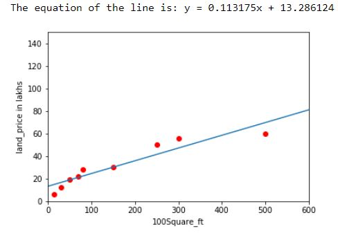

# Linear Regression
A simple code to explain regression

### The problem to be solved: Probabilistic data to be represented as a deterministic equation.
#### Linear regression addresses the above problem. We can represent probabilitic data as a deterministic equation. The output is based on the statistical information of the dependent and Independent variables.

### How do you determine the function.
#### 1. First find the mean of dependent and Independent variables.
#### 2. Calculate the error function
Q = sum(intercept + slope*xcap(i))
#### 3. For the most optimal solution. partial derivative of Q with respect to slope and intercept should be close to zero.
#### 4. Solving for slope, it can be observed that slope = Covariance(X,Y)/Variance(X^2)
#### 5. Also from the solution, the mean passes through the line.
#### 6. Therefore substituting the mean values along with slope gives the intercept value.

### The output of a Linear regression function which will be printed by the python script when run.

